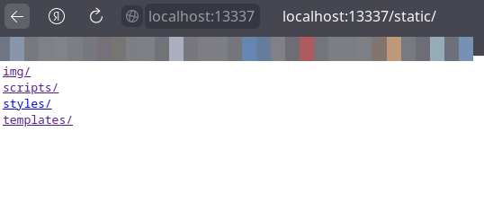
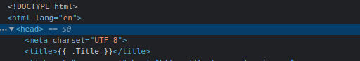
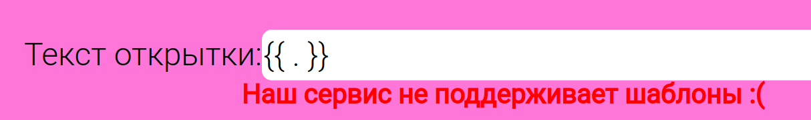
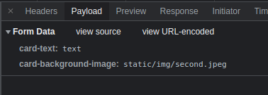
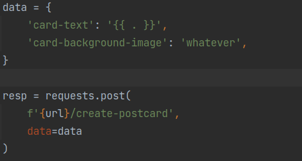
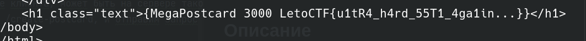

# LetoCTF Taskbot 2022 | 01-megaPostcard

Автор: [lololozhkin](https://github.com/lololozhkin)

## Информация

> Запилил крутой сервис для создания мегаоткрыток. Порадуйте себя и своих близких!

## Описание

Сервис для создания открыток, в котором из-за неаккуратности разработчика стала возможна атака типа SSTI.

## Решение

Сервис достаточно прост, он предлагает выбрать картинку и текст к этой картинке.
При нажатии на кнопку "Получить открытку", нас перекидывает на страницу с готовой открыткой, с нашим текстом и фоном.

Если посмотреть внимательней на страницу с открыткой, можно увидеть, что это не картинка, а html.
Если посмотреть запросы в браузере, можно увидеть, что при переходе на /create-postcard отправляется POST запрос на сервер, поэтому, скорее всего html готовится на сервере.

Посмотрев на html увидим, что статика подтягивается прямо с сервера из папочки /static. Если зайти на /static/ самому, окажется, что можно посмотреть все файлы статики, среди которых есть index.html.

index.html содержит в себе конструкцию {{ .Title }}. Это синтаксис gotemplate'ов. Возможно где-то прячется SSTI на gotemplate...

Попробуем в браузере в качестве текста написать {{ . }}.
Однако, браузер на такой текст выдаст ошибку о том, что сервис не поддерживает шаблоны.

**Небольшая справка**: `{{ . }}` - текущий контекст в gotemplate.
Если такой шаблон выполнится, выведется вся информация, которую передали для рендера страницы.

Но браузер валидирует данные только на стороне клиента, может быть на сервере такой валидации нет?
Посмотрим на названия полей в POST запросе на /create-postcard, и отправим запрос на создание открытки, подсунув в поле для текста `{{ . }}`.

В ответ придет html страница, в которую вставился весь контекст для рендера страницы. И в этот контекст затесался флаг!

Флаг встал как раз на место текста открытки. К тому же, можно видеть, что в тексте находится так же название сервиса Megapostcard 3000, так как это часть контекста, а именно поле `.Title`.
## Флаг

`LetoCTF{u1tR4_h4rd_55T1_4ga1in...}`
