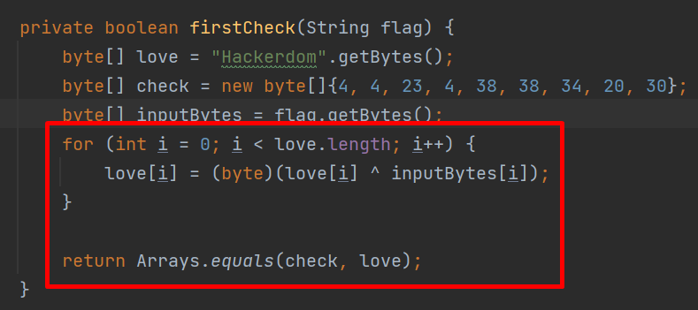
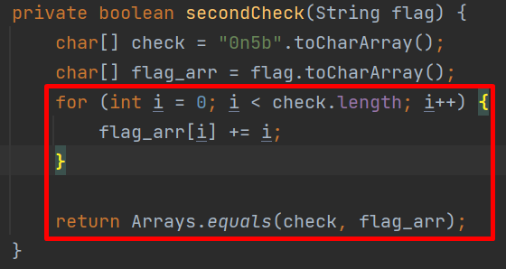
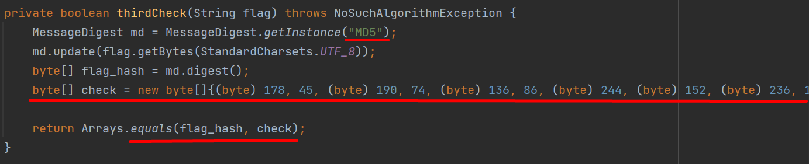
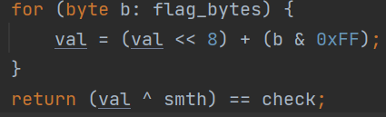
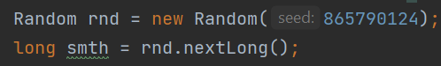
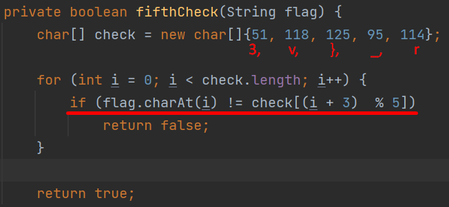

# LetoCTF Taskbot 2022 | 03-guesser

Автор: [Mashinkin](https://github.com/AlexanderKargin)

## Информация

> Поиграем в угадайку?

## Описание

Андройд приложение, которое проверяет, верный ли флаг, который ему ввели. Внутри проходит проверка на длину введенного флага, а также пять разных частей флага проверяются на соответствие определенным условиям. 
## Решение

Необходимо декомпилировать `apk` с помощью любого декомпилятора (например, `jadx dex-to-java decompiler`).

Далее изучаем 5 методов проверки введенного флага.

- Первые 9 символов ксорятся с `Hackerdom` и должны получиться определенные байты. Ксорим `Hackerdom` с данными байтами и получаем первые 9 символов
- 

- Следующие 4 символа в цикле увеличиваются на 0, 1, 2, 3. берем то, что должно получиться, вычитаем 0, 1, 2, 3 соответственно и получаем следующие 4 символа
- 

- Дальше нужно немного побрутить. Дан md5 хеш следующих 3 символов, так что перебирать не долго
- 

- В четвертой проверке 7 символов переводятся в число и ксорятся со "случайным" числом.
- 

Сид для рандома указан и рандом устроен так, что каждый раз мы будем получать одно и то же число.

Ксорим результат с "рандомным" первым значением, переводим число в строку и получаем нужный фрагмент.

- Последние 5 символов просто чциклически сдвинуты на 3 позиции вправо. Двигаем обратно и завершаем флаг
- 

## Флаг

`LetoCTF{s0m3_ez_Andr01d_r3v}`
